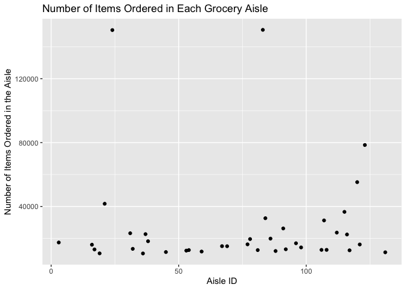

p8105\_hw3\_amh2325
================
Amanda Howarth
10/9/2019

``` r
library(tidyverse)
```

    ## ── Attaching packages ──────────────────────────────────── tidyverse 1.2.1 ──

    ## ✔ ggplot2 3.2.1     ✔ purrr   0.3.2
    ## ✔ tibble  2.1.3     ✔ dplyr   0.8.3
    ## ✔ tidyr   1.0.0     ✔ stringr 1.4.0
    ## ✔ readr   1.3.1     ✔ forcats 0.4.0

    ## ── Conflicts ─────────────────────────────────────── tidyverse_conflicts() ──
    ## ✖ dplyr::filter() masks stats::filter()
    ## ✖ dplyr::lag()    masks stats::lag()

``` r
library(p8105.datasets)
library(dplyr)
library(viridis)
```

    ## Loading required package: viridisLite

``` r
library(ggridges) 
```

    ## 
    ## Attaching package: 'ggridges'

    ## The following object is masked from 'package:ggplot2':
    ## 
    ##     scale_discrete_manual

``` r
library(patchwork)
```

## Loading instacart data

``` r
library(p8105.datasets)
data("instacart")
```

## Exploring Instacart dataset

``` r
instacart %>%
  count(aisle_id)%>%
  arrange(desc(n))
```

    ## # A tibble: 134 x 2
    ##    aisle_id      n
    ##       <int>  <int>
    ##  1       83 150609
    ##  2       24 150473
    ##  3      123  78493
    ##  4      120  55240
    ##  5       21  41699
    ##  6      115  36617
    ##  7       84  32644
    ##  8      107  31269
    ##  9       91  26240
    ## 10      112  23635
    ## # … with 124 more rows

\#There are 134 aisles. The most items are ordered from Aisle 83 (150609
items), Aisle 24 (150473 items), and 123 (78493 items).

\#Make a plot that shows the number of items ordered in each aisle,
limiting this to aisles with more than 10000 items ordered. Arrange
aisles sensibly, and organize your plot so others can read it.

``` r
instacart%>%
  count(aisle_id)%>%
  filter(n > 10000)%>%
  ggplot(aes(x = aisle_id, y = n)) + geom_point() +
  labs(title = "Number of Items Ordered in Each Grocery Aisle", 
                x = "Aisle ID",
                y = "Number of Items Ordered in the Aisle")
```

<!-- -->
\#\# Make a table showing the three most popular items in each of the
aisles “baking ingredients”, “dog food care”, and “packaged vegetables
fruits”. Include the number of times each item is ordered in your table.

``` r
popular_items_table=
instacart %>%
  group_by(aisle) %>%
  count(product_name, name = "count") %>%
  filter(aisle %in% c("baking ingredients", "dog food care", "packaged vegetables fruits")) %>%
  mutate(rank = min_rank(desc(count))) %>%
  filter(min_rank(rank) < 4)
```

``` r
apples_icecream_table =
  instacart %>%
  select(product_name, order_dow, order_hour_of_day)%>% 
  group_by(product_name, order_dow) %>%
  filter(product_name %in% c("Pink Lady Apples", "Coffee Ice Cream"))%>% 
  summarise(mean_hour_of_day = mean(order_hour_of_day)) %>%
  mutate(order_dow = recode(order_dow, "0" = "sunday", "1" = "monday", "2" = "tuesday", "3" = "wednesday", "4" = "thursday", "5" = "friday", "6" = "saturday"))%>% 
  pivot_wider(names_from = "order_dow", values_from = "mean_hour_of_day")
```

\#\#Loading BRFSS data

``` r
data("brfss_smart2010")
```

``` r
brfss_smart2010 %>%
  janitor::clean_names() %>%
  filter(topic == "Overall Health") %>%
  filter(response %in% c("Poor", "Fair", "Good", "Very Good", "Excellent")) %>%
  mutate(response = forcats::fct_relevel(response, c("Poor", "Fair", "Good", "Very Good", "Excellent")))
```

    ## Warning: Unknown levels in `f`: Very Good

    ## # A tibble: 8,500 x 23
    ##     year locationabbr locationdesc class topic question response
    ##    <int> <chr>        <chr>        <chr> <chr> <chr>    <fct>   
    ##  1  2010 AL           AL - Jeffer… Heal… Over… How is … Excelle…
    ##  2  2010 AL           AL - Jeffer… Heal… Over… How is … Good    
    ##  3  2010 AL           AL - Jeffer… Heal… Over… How is … Fair    
    ##  4  2010 AL           AL - Jeffer… Heal… Over… How is … Poor    
    ##  5  2010 AL           AL - Mobile… Heal… Over… How is … Excelle…
    ##  6  2010 AL           AL - Mobile… Heal… Over… How is … Good    
    ##  7  2010 AL           AL - Mobile… Heal… Over… How is … Fair    
    ##  8  2010 AL           AL - Mobile… Heal… Over… How is … Poor    
    ##  9  2010 AL           AL - Tuscal… Heal… Over… How is … Excelle…
    ## 10  2010 AL           AL - Tuscal… Heal… Over… How is … Good    
    ## # … with 8,490 more rows, and 16 more variables: sample_size <int>,
    ## #   data_value <dbl>, confidence_limit_low <dbl>,
    ## #   confidence_limit_high <dbl>, display_order <int>,
    ## #   data_value_unit <chr>, data_value_type <chr>,
    ## #   data_value_footnote_symbol <chr>, data_value_footnote <chr>,
    ## #   data_source <chr>, class_id <chr>, topic_id <chr>, location_id <chr>,
    ## #   question_id <chr>, respid <chr>, geo_location <chr>
