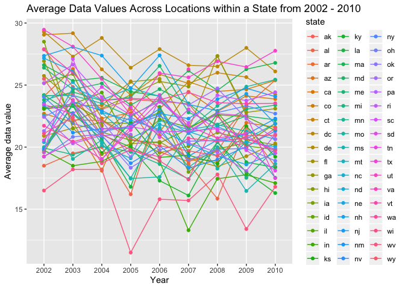
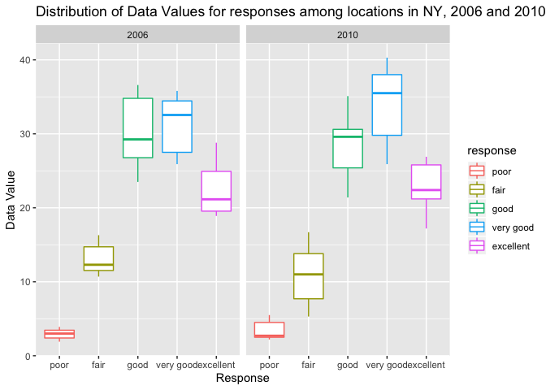
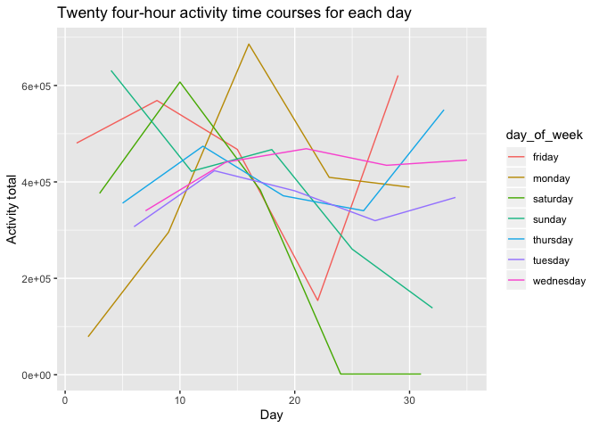

p8105\_hw3\_amh2325
================
Amanda Howarth
10/9/2019

``` r
library(tidyverse)
```

    ## ── Attaching packages ─────────────────────────────────────────────────── tidyverse 1.2.1 ──

    ## ✔ ggplot2 3.2.1     ✔ purrr   0.3.2
    ## ✔ tibble  2.1.3     ✔ dplyr   0.8.3
    ## ✔ tidyr   1.0.0     ✔ stringr 1.4.0
    ## ✔ readr   1.3.1     ✔ forcats 0.4.0

    ## ── Conflicts ────────────────────────────────────────────────────── tidyverse_conflicts() ──
    ## ✖ dplyr::filter() masks stats::filter()
    ## ✖ dplyr::lag()    masks stats::lag()

``` r
library(dplyr)
library(viridis)
```

    ## Loading required package: viridisLite

``` r
library(ggridges) 
```

    ## 
    ## Attaching package: 'ggridges'

    ## The following object is masked from 'package:ggplot2':
    ## 
    ##     scale_discrete_manual

``` r
library(patchwork)
library(knitr)
library(ggplot2)
```

## Loading instacart data

``` r
library(p8105.datasets)
data("instacart")
```

## Exploring Instacart dataset

This dataset has 1384617 observations and 15 variables. The following
variables are class `character`: `product_name`, `aisle`, and
`department`. All other variables are class `integer`. Key variables
include the product\_name (a descriptive name of the product), aisle
(aisle identifier), and the department (deparmtent identifier). An
illustrative example from this dataset is customer with `user_id` 112108
ordered Bulgarian yogurt, located in the Yogurt aisle (`department` =
dairy eggs). The customer has ordered the Bulgarian yogurt once in the
past. This was the first item added to their cart (identified by the
variable
`add_to_cart_order`).

## How many aisles are there, and which aisles are the most items ordered from?

``` r
instacart %>%
  count(aisle_id)%>%
  arrange(desc(n))
```

    ## # A tibble: 134 x 2
    ##    aisle_id      n
    ##       <int>  <int>
    ##  1       83 150609
    ##  2       24 150473
    ##  3      123  78493
    ##  4      120  55240
    ##  5       21  41699
    ##  6      115  36617
    ##  7       84  32644
    ##  8      107  31269
    ##  9       91  26240
    ## 10      112  23635
    ## # … with 124 more rows

There are 134 aisles. The most items are ordered from Aisle 83 (150609
items), Aisle 24 (150473 items), and 123 (78493
items).

## Make plot showing the number of items ordered in each aisle, limiting this to aisles with more than 10000 items ordered.

``` r
instacart%>%
  count(aisle_id)%>%
  filter(n > 10000)%>%
  ggplot(aes(x = aisle_id, y = n)) + geom_point() +
  labs(title = "Number of Items Ordered in Each Grocery Aisle", 
                x = "Aisle ID",
                y = "Number of Items Ordered in the Aisle")
```

<!-- -->
\#\# Making a table showing the three most popular items in each of the
aisles “baking ingredients”, “dog food care”, and “packaged vegetables
fruits”. Including the number of times each item is ordered in table.

``` r
popular_items_table=
instacart %>%
  group_by(aisle) %>%
  count(product_name, name = "count") %>%
  filter(aisle %in% c("baking ingredients", "dog food care", "packaged vegetables fruits")) %>%
  mutate(rank = min_rank(desc(count))) %>%
  filter(min_rank(rank) < 4) %>% 
  knitr::kable() %>% 
    print()
```

    ## 
    ## 
    ## aisle                        product_name                                     count   rank
    ## ---------------------------  ----------------------------------------------  ------  -----
    ## baking ingredients           Cane Sugar                                         336      3
    ## baking ingredients           Light Brown Sugar                                  499      1
    ## baking ingredients           Pure Baking Soda                                   387      2
    ## dog food care                Organix Chicken & Brown Rice Recipe                 28      2
    ## dog food care                Small Dog Biscuits                                  26      3
    ## dog food care                Snack Sticks Chicken & Rice Recipe Dog Treats       30      1
    ## packaged vegetables fruits   Organic Baby Spinach                              9784      1
    ## packaged vegetables fruits   Organic Blueberries                               4966      3
    ## packaged vegetables fruits   Organic Raspberries                               5546      2

## Making a table showing the mean hour of the day at which Pink Lady Apples and Coffee Ice Cream are ordered on each day of the week.

``` r
apples_icecream_table =
  instacart %>%
  select(product_name, order_dow, order_hour_of_day) %>% 
  group_by(product_name, order_dow) %>%
  filter(product_name %in% c("Pink Lady Apples", "Coffee Ice Cream")) %>% 
  summarise(mean_hour_of_day = mean(order_hour_of_day)) %>%
  mutate(order_dow = recode(order_dow, "0" = "sunday", "1" = "monday", "2" = "tuesday", 
                            "3" = "wednesday", "4" = "thursday", "5" = "friday", "6" = "saturday")) %>% 
  pivot_wider(names_from = "order_dow", values_from = "mean_hour_of_day")%>%
   knitr::kable() %>% 
    print()
```

    ## 
    ## 
    ## product_name          sunday     monday    tuesday   wednesday   thursday     friday   saturday
    ## -----------------  ---------  ---------  ---------  ----------  ---------  ---------  ---------
    ## Coffee Ice Cream    13.77419   14.31579   15.38095    15.31818   15.21739   12.26316   13.83333
    ## Pink Lady Apples    13.44118   11.36000   11.70213    14.25000   11.55172   12.78431   11.93750

## Problem 2

## Loading BRFSS data

``` r
data("brfss_smart2010")
```

## Cleaning BRFSS data

``` r
brfss_overall_clean = brfss_smart2010 %>%
  janitor::clean_names() %>%
  filter(topic == "Overall Health") %>%
  mutate_all(tolower) %>%
  filter(response %in% c("poor", "fair", "good", "very good", "excellent")) %>%
  mutate(response = forcats::fct_relevel(response, c("poor", "fair", "good", "very good", "excellent"))) %>%
  rename("state" = "locationabbr", "county" = "locationdesc")
```

## In 2002, which states were observed at 7 or more locations? What about in 2010?

``` r
brfss_2002 = brfss_overall_clean %>%
  group_by(year, state) %>%
  summarize(n = n_distinct(geo_location)) %>%
  filter(year == "2002", n >= 7) %>%
 knitr::kable() %>% 
    print()
```

    ## 
    ## 
    ## year   state     n
    ## -----  ------  ---
    ## 2002   ct        7
    ## 2002   fl        7
    ## 2002   ma        8
    ## 2002   nc        7
    ## 2002   nj        8
    ## 2002   pa       10

``` r
brfss_2010 = brfss_overall_clean %>%
  group_by(year, state) %>%
  summarize(n = n_distinct(geo_location)) %>%
  filter(year == "2010", n >= 7) %>%
 knitr::kable() %>% 
    print()
```

    ## 
    ## 
    ## year   state     n
    ## -----  ------  ---
    ## 2010   ca       12
    ## 2010   co        7
    ## 2010   fl       41
    ## 2010   ma        9
    ## 2010   md       12
    ## 2010   nc       12
    ## 2010   ne       10
    ## 2010   nj       19
    ## 2010   ny        9
    ## 2010   oh        8
    ## 2010   pa        7
    ## 2010   sc        7
    ## 2010   tx       16
    ## 2010   wa       10

In 2002, six states (CT\[7\], FL\[7\], MA\[8\], NC\[7\], NJ\[8\],
PA\[10\]) were observed at more than seven locations. In 2010, fourteen
states (CA\[12\], CO\[7\], FL\[41\], MA\[9\], MD\[12\], NC\[12\],
NE\[10\], NJ\[19\], NY\[9\], OH\[8\], PA\[7\], SC\[7\], TX\[16\],
WA\[10\]) were observed at more than seven
locations.

## Constructing a dataset limited to Excellent responses, and contains, year, state, and a variable that averages the data\_value across locations within a state.

``` r
brfss_excellent = brfss_overall_clean %>%
  mutate(data_value = as.numeric(data_value)) %>%
  filter(response %in% c("excellent")) %>% 
  group_by(state, year, response) %>%
    summarize(data_value_average = mean(data_value)) %>%
  select(year, state, data_value_average)
```

## Making a “spaghetti” plot of this average value over time within a state.

``` r
ggplot(brfss_excellent, aes(x = year, y = data_value_average, group = state, color = state)) + 
  geom_point() + geom_line() + 
  labs(title = "Average Data Values Across Locations within a State from 2002 - 2010", 
           x = "Year",
           y = "Average data value")
```

    ## Warning: Removed 4 rows containing missing values (geom_point).

    ## Warning: Removed 3 rows containing missing values (geom_path).

<!-- -->

## Making two-panel plot showing, for the years 2006, and 2010, distribution of data\_value for responses (“Poor” to “Excellent”) among locations in NY State.

``` r
brfss_plot2006_2010 = brfss_overall_clean %>%
  mutate(data_value = as.numeric(data_value)) %>%
  filter(state == "ny", year == "2006" | year == "2010") %>%
  select(state, year, response, data_value, geo_location)

brfss_plot2006_2010%>%
    ggplot(aes(x = response, y = data_value, color = response)) + 
    geom_boxplot() + 
    facet_wrap(. ~ year) + 
    labs(
    title = "Distribution of Data Values for responses among locations in NY, 2006 and 2010",
    x = "Response",
    y = "Data Value")
```

<!-- -->

``` r
plot_2006 = 
  brfss_plot2006_2010 %>%
  filter(year == "2010") %>%
  ggplot(aes(x = year, y = data_value_average), group = geo_location, color = blue) + geom_point()
```

## Problem \#3

## Loading Accel\_data. Tidying and Wrangling.

``` r
accel_data = 
  read_csv(file = "./data/accel_data.csv")
```

    ## Parsed with column specification:
    ## cols(
    ##   .default = col_double(),
    ##   day = col_character()
    ## )

    ## See spec(...) for full column specifications.

``` r
accel_data_clean = accel_data %>%
  janitor::clean_names() %>%
  mutate(day = str_to_lower(day)) %>%
    mutate(weekday_vs_weekend = case_when(
    day == "monday" ~ "weekday",
    day == "tuesday" ~ "weekday",
    day == "wednesday" ~ "weekday",
    day == "thursday" ~ "weekday",
    day == "friday" ~ "weekday",
    day == "saturday" ~ "weekend",
    day == "sunday" ~ "weekend")) %>% 
  mutate_if(is.numeric, round, digits = 2) %>% 
  rename(`day_of_week` = day) %>%
select(week, day_id, day_of_week, weekday_vs_weekend, everything())
```

There are 35 observations and 1444 variables in `accel_data_clean`.
There is a variable `week` for which week the man wore the
accelerometer, variable `day_id` indicating which day of the 35 days the
man wore the accelerometer, variable `day_of_week` indicating which day
of the week (Monday, Tuesday, etc.), and `weekday_vs_weekend` indicating
if the day was during the week or on the weekend. Lastly, there are 1440
variables for activity\_\*, the activity counts for each minute of a
24-hour day starting at
midnight.

## Aggregating accross minutes to create a total activity variable for each day, and creating a table showing these totals.

``` r
accel_total_table = accel_data_clean %>%
  pivot_longer(activity_1:activity_1440, names_to = "minute", values_to = "activity_total") %>%
  group_by(week, day_id, day_of_week) %>% 
  summarise(activity_total_day = sum(activity_total))
```

## Are any trends apparent?

There are no trends apparent in the table. The variable
“activity\_total\_day” increases and decreases with no trend or
pattern.

## Making a single-panel plot that shows the 24-hour activity time courses for each day and using color to indicate day of the week.

``` r
accel_total_table %>%
  ggplot(aes(x = day_id, y = activity_total_day, color = day_of_week)) + geom_line() + 
  labs(title = "Twenty four-hour activity time courses for each day ", 
           x = "Day",
           y = "Activity total")
```

<!-- -->

Are there any patterns or conclusions you can make based on this graph?
From the graph above, I can conclude that the the man’s physical
activity peaked on a Monday, day 16, in the third week. The man’s
activity was at his lowest for two Saturdays in week 4 and week 5. For
weekends, the man’s physical activity at baseline (day 1) was greater
than his activity at the end (day 35). For weekdays, the man’s physical
activity was reported to be higher than at baseline.
